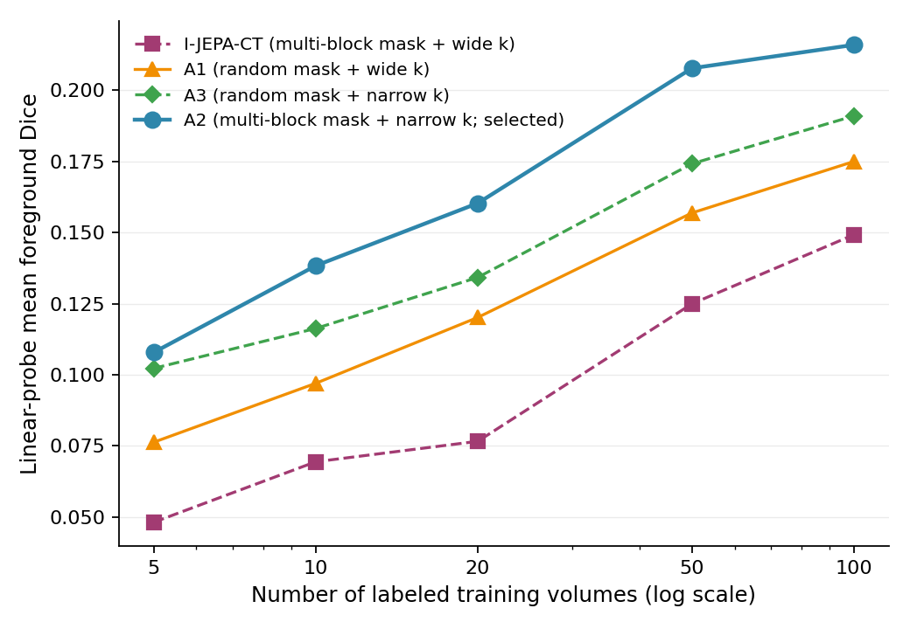
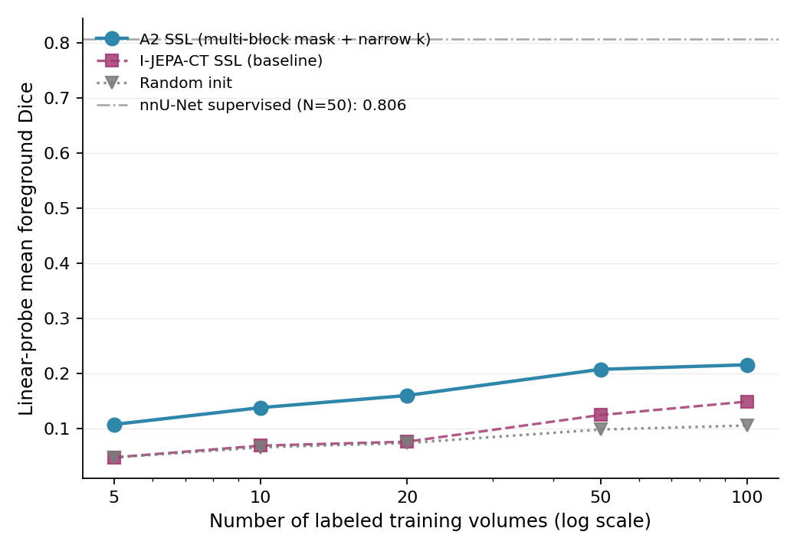

# SSLR — Self-Supervised Pretraining for Label-Efficient CT Segmentation

Adapting **I-JEPA** (Joint-Embedding Predictive Architecture) to **2.5D CT slice pairs**, and
testing a concrete question: *do I-JEPA's natural-image design choices transfer to slice-redundant
medical CT?* A **two-axis masking × slice-gap comparison** says they do **not** — the selected
recipe changes the slice gap while retaining multi-block masking.

<p align="center">
  <br>
  <sub><b>The main result.</b> Inverting <i>either</i> I-JEPA choice (masking, or — dominantly — the
  slice gap) beats the natural-image-style baseline; the two inversions are <i>not</i> additive.</sub>
</p>

> **Headline.** The recommended backbone — **A2 = multi-block masking + a _narrow_ slice gap
> (k = 3–7)** — beats random initialization at every label budget under both linear-probe and
> fine-tune protocols, and its frozen features survive cross-dataset and cross-modality shifts.

---

## Key findings

- **The I-JEPA recipe does not transfer.** A *narrow* slice gap beats a wide gap by **45–124%**, and
  random masking beats multi-block by **17–59%**, under linear probing. The two inversions are not
  additive (A3, the combined configuration, *loses* to A2 by 5–16%). **Recommended: narrow gap +
  multi-block (A2).** The slice gap is the dominant axis.
- **A2 beats random init at every N** — linear probe ≈ +100–125%; fine-tune +13.0% → +8.5% → +2.8%
  at N = 20/50/100 (4 seeds), significant at N = 20 and N = 50.
- **SSL reduces fine-tune seed variance 1.3–2.2×.**
- **Transfer holds:** frozen A2 features beat random init on **AMOS-CT (+158–260%)** and even
  **AMOS-MR (+41–48%)** — having never seen an MR slice.
- **Honest ceiling:** A2 fine-tune recovers **67%** of a fully-supervised nnU-Net at a matched
  N = 50 budget. We do **not** claim parity with supervised methods or with 3D SwinUNETR. The
  contribution is the **ablation + protocol analysis + cross-arch/cross-modality corroboration** —
  not SOTA Dice.

---

## Method

ViT-B/16 context encoder, EMA target encoder (m = 0.996), 4-layer predictor, Smooth-L1 on masked
target embeddings, bf16. Two design axes are ablated: **target masking** (multi-block 40% vs random
per-patch 0.75) and **context–target slice gap** (wide k = 8–20 vs narrow k = 3–7).

| Backbone | Masking | Slice gap | Role |
|---|---|---|---|
| `I-JEPA-CT` | multi-block | wide | baseline |
| `A1` | random | wide | masking inversion |
| **`A2`** | **multi-block** | **narrow** | **selected configuration** |
| `A3` | random | narrow | combined configuration / interaction test |

The submitted-paper names above are the canonical public terminology. Historical experiment paths
are retained so checkpoints remain auditable: `v2` → I-JEPA-CT, `loo_a1_random_mask` → A1,
`loo_a3_narrow_k` → A2, and `loo_a5_dense_narrow`/`a5` → A3.
See [`NAMING.md`](NAMING.md) for the complete paper-name-to-run-identifier map.

Downstream: frozen **linear probe** (1×1 head) and **end-to-end fine-tune** (LLRD 0.75,
lr_backbone 1e-4). Data: TotalSegmentator, 10-organ subset, 224×224, 57-volume val.

---

## Results

### Masking × slice-gap factorial comparison — linear probe (single seed)

| N | I-JEPA-CT (block+wide) | A1 (random+wide) | **A2 (block+narrow)** | A3 (random+narrow) | A2 vs I-JEPA-CT |
|---|---|---|---|---|---|
| 5   | 0.0481 | 0.0763 | **0.1078** | 0.1022 | **+124%** |
| 20  | 0.0766 | 0.1201 | **0.1603** | 0.1342 | +109% |
| 50  | 0.1249 | 0.1569 | **0.2077** | 0.1742 | +66% |
| 100 | 0.1492 | 0.1749 | **0.2159** | 0.1910 | +45% |

### Data efficiency under linear probing

<p align="center">
  <br>
  <sub>A2 (frozen) vs I-JEPA-CT vs random initialization; nnU-Net supervised reference dashed at 0.806.</sub>
</p>

### End-to-end fine-tuning (4 seeds, lr_backbone = 1e-4)

| N | A2 SSL (mean ± std) | Random (mean ± std) | Δ rel | Welch p |
|---|---|---|---|---|
| 20  | **0.3803 ± 0.0094** | 0.3365 ± 0.0207 | **+13.0%** | 0.017 (*) |
| 50  | **0.5426 ± 0.0042** | 0.5003 ± 0.0078 | **+8.5%**  | <0.001 (***) |
| 100 | **0.5891 ± 0.0082** | 0.5729 ± 0.0107 | +2.8% | 0.054 (ns) |

### Recovery vs supervised nnU-Net (matched N = 50)

nnU-Net 2D supervised ceiling = **0.8058** mean fg Dice. A2 fine-tune at the matched N = 50 budget
recovers **67%** — liver **90%**, pancreas the floor at **28%**. Recovery is inversely correlated
with organ size and intensity contrast.

### Cross-architecture corroboration — matched SwinUNETR fine-tune

3D SwinUNETR (~5× more pretraining CT), fine-tuned under the **same recipe**, **beats A2 on absolute
Dice** (it is 3D and far more pretrained — we do *not* claim parity). The keeper finding is
**corroboration**: in the completed four-seed comparison, its within-method SSL-vs-random gap
declines from **+17.9% at N = 20** to **+0.6% at N = 50** and **−1.5% at N = 100**,
independently reproducing the label-dependent convergence on a different architecture.

### Cross-dataset & cross-modality transfer (frozen A2, 4 seeds)

| Transfer | N = 20 | N = 50 | N = 100 |
|---|---|---|---|
| **AMOS-CT** (cross-dataset, A2 vs random) | +260.1% | +196.9% | +158.0% |
| **AMOS-MR** (cross-modality, never saw MR) | +47.5% | +41.1% | — |

The CT→MR gap is smaller than the cross-dataset CT gap (modality shift erodes part of the transfer)
but stays large and positive — evidence of partially **modality-invariant** features. (MR is
linear-probe-only; only 39 MR volumes pass full coverage, so N = 50 exhausts the pool.)

---

## What this repo claims (and does not)

**Defensible:** A2 SSL beats random init at every N under both protocols; I-JEPA's
natural-image choices do not transfer to CT; 67% supervised recovery at matched N = 50; reduced
fine-tune variance; positive cross-dataset and cross-modality transfer.

**Not claimed:** that SSL approaches/beats supervised performance, or that we match 3D SwinUNETR on
Dice (we do not — it wins by 8–17% under a matched protocol). SwinUNETR is used as cross-architecture
*corroboration*, not a Dice comparison we win.

---

## Repository layout

```
src/
  data/    2.5D triplet loader, preprocessing, labeled-slice dataset
  models/  ViT-JEPA backbone (context/target ViT, predictor, masking), seg heads
  train/   SSL pretraining loop; --out_dir/--data_root/--k_range/--no_augment for LOO
scripts/
  make_figures_submission.py  result figures with submitted-paper labels
  train_decoder.py          frozen linear/conv probe
  train_swinunetr.py        matched SwinUNETR fine-tune baseline
  significance_test.py      Welch t-tests for the multi-seed cells
  queue_loo_pretrain.sh     factorial backbone pretraining (historical run IDs)
  queue_ft_a3_multiseed.sh  A2 4-seed fine-tune (historical filename)
  queue_amos_linprobe.sh    AMOS-CT cross-dataset probe
  queue_mri_multiseed.sh    AMOS-MR cross-modality probe (4 seeds)
  eval_nnunet_predictions.py  supervised ceiling at 224×224
  test_inference/           held-out-test evaluation harness (artifacts excluded)
experiment_archive/        post-submission result tables, costs, and validity notes
figures_submission/  result figures (PNG + PDF)
```

## Setup & reproduce

```bash
python -m venv venv && source venv/bin/activate
pip install torch timm nibabel scipy pandas tqdm matplotlib monai nnunetv2

# Pretrain A2 (multi-block masking + narrow slice gap)
# The output directory retains the historical experiment identifier.
python -m src.train.pretrain --mask_mode block --mask_ratio 0.4 --n_blocks 4 \
    --k_range 3 7 --out_dir checkpoints/loo_a3_narrow_k

# 4-seed fine-tune at the headline operating point, then regenerate figures
bash scripts/queue_ft_a3_multiseed.sh
python scripts/make_figures_submission.py
```

Expects TotalSegmentator under `totalsegmentator/` and preprocessed slices under
`data/slices/{train,val}/`. Single RTX 3090 Ti (24 GB); 2.5D (not 3D) backbone for compute
tractability.

## Caveats

4 seeds for the headline A2 and SwinUNETR comparisons; single LR sweep (at N = 50, transferred to
A2); cross-modality linear-probe-only and capped at 39 MR volumes. A2 eval is 2D slice-wise Dice vs
3D volume-wise for nnU-Net/SwinUNETR. See [`experiment_archive/`](experiment_archive/) for the
post-submission audit tables, compute measurements, and held-out-test validity notes.
