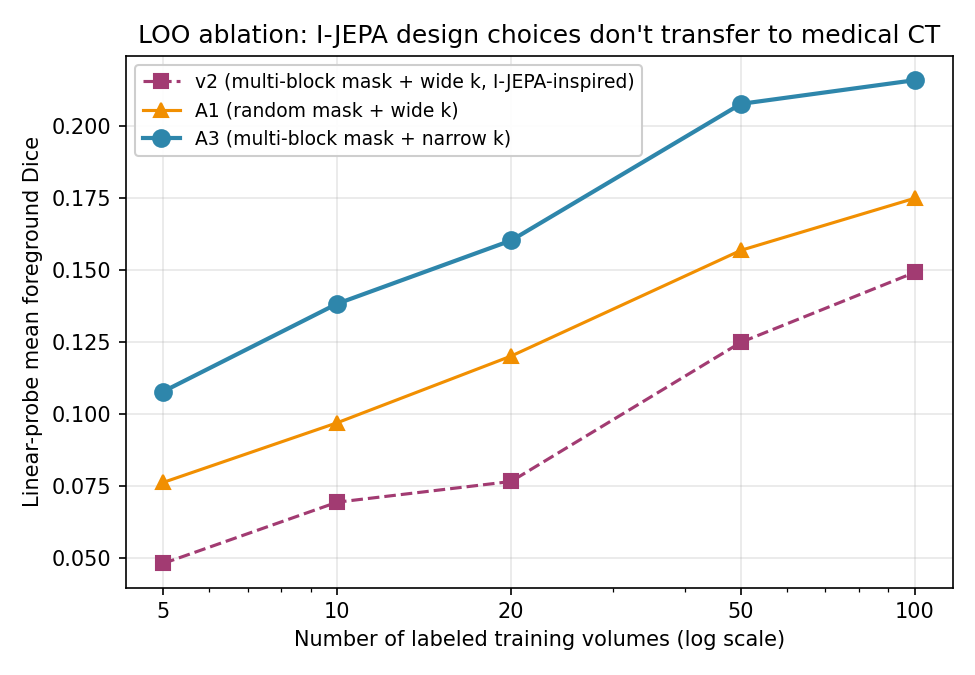
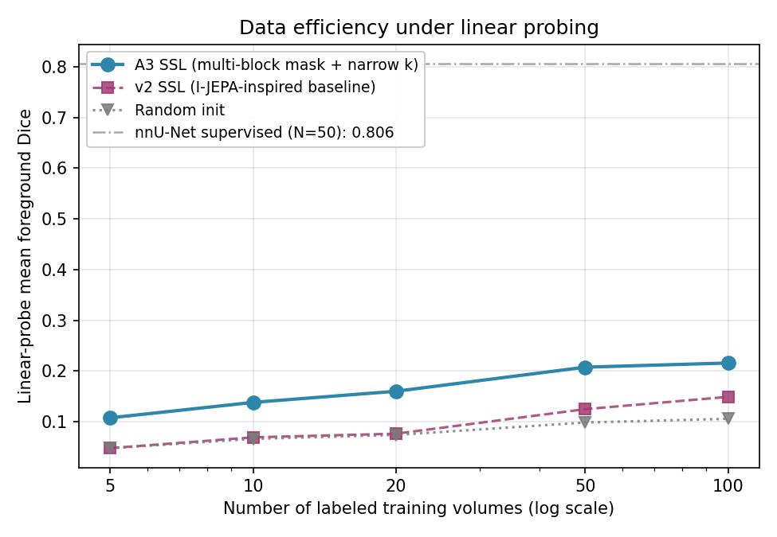
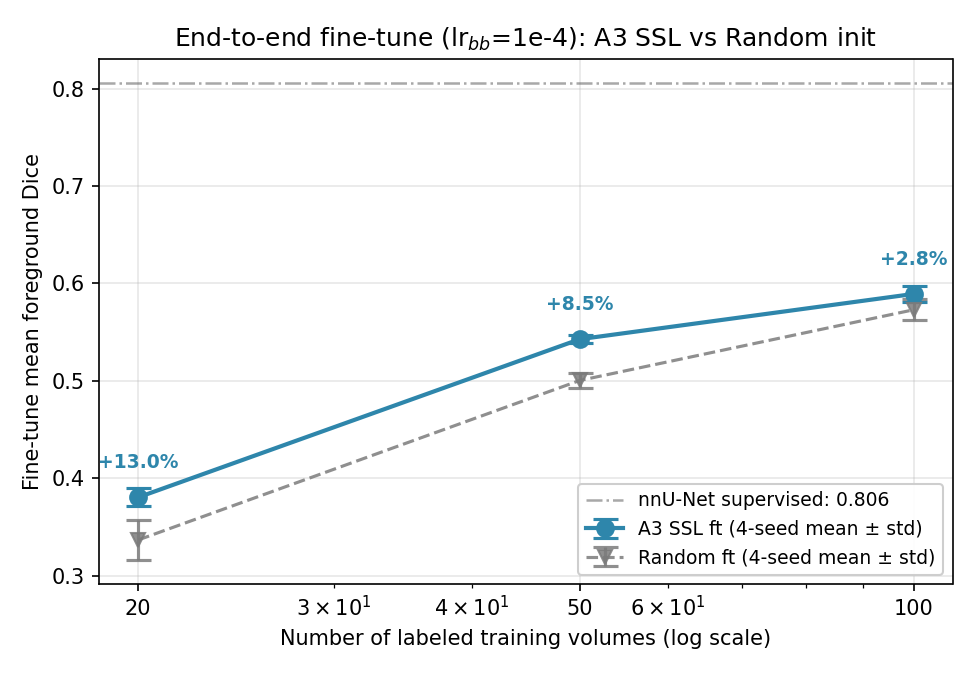
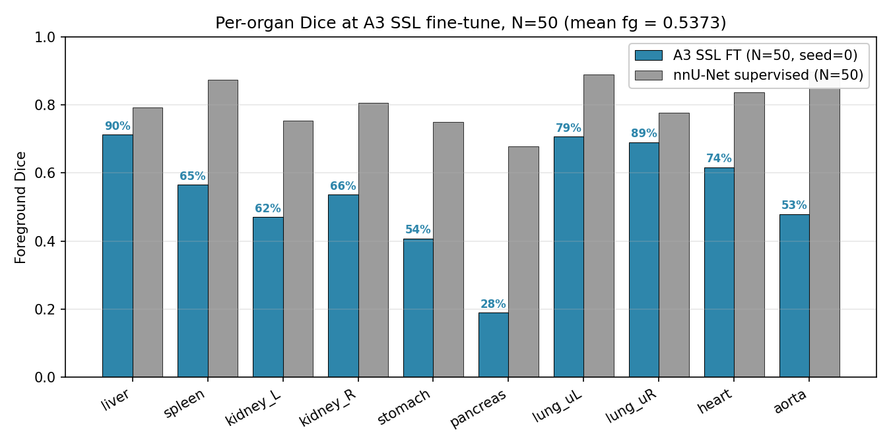
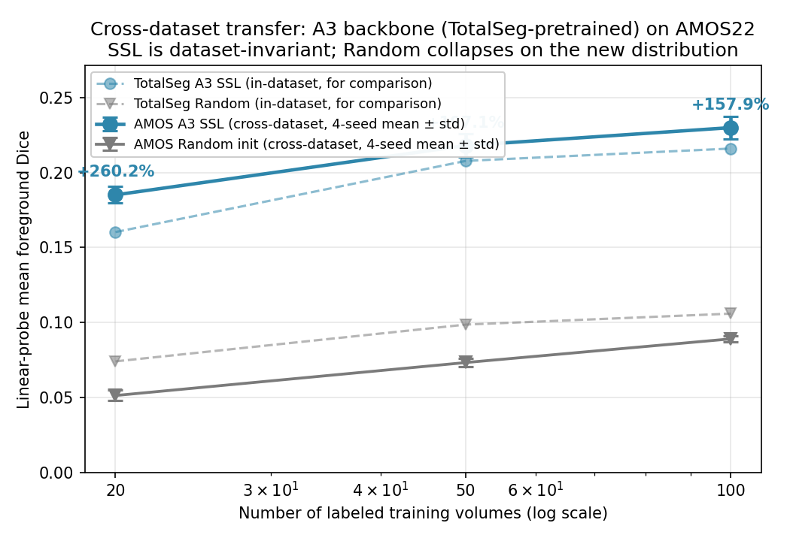
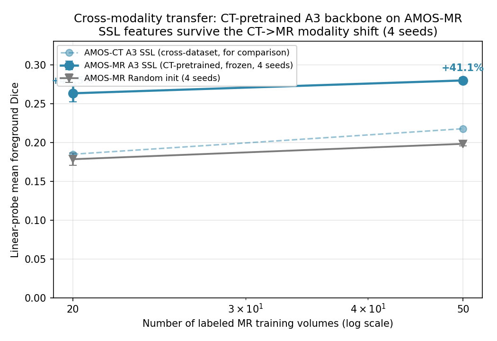

# SSLR — Self-Supervised Pretraining for Label-Efficient CT Segmentation

Adapting **I-JEPA** (Joint-Embedding Predictive Architecture) to **2.5D CT slice pairs**, and
asking a concrete question: *do I-JEPA's natural-image design choices actually transfer to
slice-redundant medical CT?* Via a **leave-one-out (LOO) ablation** we show they do **not** —
and the recipe that works is the *inverse* of the natural-image default.

> **Headline.** Inverting **either** of I-JEPA's two key choices (target masking; context–target
> slice gap) individually beats the natural-image-style baseline. The slice gap is the dominant
> axis. The recommended backbone, **A3 = multi-block masking + a *narrow* slice gap (k = 3–7)**,
> beats random initialization at every label budget under both linear-probe and fine-tune
> protocols, and its features survive cross-dataset and cross-modality shifts.

---

## Key findings

1. **The I-JEPA recipe does not transfer; the inverse is better.** A LOO ablation over masking and
   slice-gap shows a *narrow* gap beats a wide gap by **45–124%**, and random masking beats
   multi-block by **17–59%**, under linear probing. The two inversions are **not additive** — the
   combined backbone (`a5`) *loses* to A3 by 5–16%. **Recommended: narrow gap + multi-block (A3).**
2. **A3 beats random init at every N under both protocols** — linear probe ≈ +100–125%;
   fine-tune +13.0% → +8.5% → +2.8% at N = 20/50/100 (4 seeds), significant at N = 20 and N = 50.
3. **SSL pretraining reduces fine-tune seed variance 1.3–2.2×.**
4. **Transfer holds:** frozen A3 features survive a cross-dataset shift to **AMOS-CT (+158–260%)**
   and even a cross-modality shift to **AMOS-MR (+41–48%)** — never having seen an MR slice.
5. **Honest ceiling:** A3 fine-tune recovers **67%** of a fully-supervised nnU-Net at a matched
   N = 50 budget. We do **not** claim parity with supervised methods or with 3D SwinUNETR (which,
   under a matched fine-tune, wins on absolute Dice — see below). Our contribution is the
   **ablation + protocol analysis + cross-arch/cross-modality corroboration**, not SOTA Dice.

---

## Method

- **Backbone:** ViT-B/16 context encoder, EMA target encoder (m = 0.996), 4-layer Transformer
  predictor with learnable mask token. Smooth-L1 loss on masked target embeddings. bf16, grad-clip 1.0.
- **The two ablated axes:** target masking (*multi-block, 40%* vs *random per-patch, 0.75*) and
  context–target slice gap (*wide k = 8–20* vs *narrow k = 3–7*).
- **Backbones:** `v2` = multi-block + wide (I-JEPA-style baseline); **`A3` = multi-block + narrow
  (headline)**; `A1` = random + wide; `a5` = random + narrow (additivity test).
- **Downstream:** frozen **linear probe** (1×1 head, 2D slice-wise Dice) and **end-to-end
  fine-tune** (ConvSegHead, LLRD 0.75, lr_backbone 1e-4). Data: TotalSegmentator, 10-organ subset,
  224×224, 57-volume val.

---

## Results

### 1. Leave-one-out ablation — the main contribution

Inverting either I-JEPA choice beats the `v2` baseline; the two inversions are not additive
(`a5` < `A3`). The **slice gap is dominant**, and optimal masking is gap-dependent.



| N | v2 (block + wide) | A1 (random + wide) | **A3 (block + narrow)** | a5 (random + narrow) | A3 vs v2 |
|---|---|---|---|---|---|
| 5   | 0.0481 | 0.0763 | **0.1078** | 0.1022 | **+124%** |
| 20  | 0.0766 | 0.1201 | **0.1603** | 0.1342 | +109% |
| 50  | 0.1249 | 0.1569 | **0.2077** | 0.1742 | +66% |
| 100 | 0.1492 | 0.1749 | **0.2159** | 0.1910 | +45% |

### 2. Data efficiency under linear probing

A3 (frozen) vs the I-JEPA-style v2 vs random init; nnU-Net supervised reference dashed at 0.806.



### 3. End-to-end fine-tuning (4 seeds, lr_backbone = 1e-4)

A3 beats random at every N; the gap shrinks with labels but stays positive, and SSL lowers
seed variance.



| N | A3 SSL (mean ± std) | Random (mean ± std) | Δ rel | Welch p |
|---|---|---|---|---|
| 20  | **0.3803 ± 0.0094** | 0.3365 ± 0.0207 | **+13.0%** | 0.017 (*) |
| 50  | **0.5426 ± 0.0042** | 0.5003 ± 0.0078 | **+8.5%**  | <0.001 (***) |
| 100 | **0.5891 ± 0.0082** | 0.5729 ± 0.0107 | +2.8% | 0.054 (ns) |

### 4. Per-organ recovery vs supervised nnU-Net (matched N = 50)

nnU-Net 2D supervised ceiling = **0.8058** mean fg Dice. A3 fine-tune at the matched N = 50 budget
recovers **67%**; liver reaches 90%, pancreas is the floor at 28%. (Recovery is conservative — the
probe is evaluated over all 57 val volumes incl. 5 organ-free ones; nnU-Net over the 52 non-empty.)



### 5. Cross-architecture corroboration — matched SwinUNETR fine-tune

3D SwinUNETR (Tang et al. 2022, ~5× more pretraining CT) fine-tuned end-to-end under the **same
recipe**. It **beats A3 on absolute Dice by 8–17%** (it is 3D and far more pretrained — we do *not*
claim parity). The keeper finding is **corroboration**: SwinUNETR's within-method SSL-vs-random gap
**collapses with N** (+7.7% → +0.83% → parity), independently reproducing A3's fine-tune law on a
different architecture.

### 6. Cross-dataset & cross-modality transfer (frozen A3, 4 seeds)

| Transfer | N = 20 | N = 50 | N = 100 |
|---|---|---|---|
| **AMOS-CT** (cross-dataset, A3 vs random) | +260.1% | +196.9% | +158.0% |
| **AMOS-MR** (cross-modality, never saw MR) | +47.5% | +41.1% | — |




The CT→MR gap (+41–48%) is smaller than the cross-dataset CT gap (modality shift erodes part of
the transfer) but stays large and positive — evidence the features are partially
**modality-invariant**. (MR is linear-probe-only; only 39 MR volumes pass full 7-class coverage,
so N = 50 exhausts the pool and N = 100 is dropped as a duplicate.)

---

## What this repo claims (and does not)

**Defensible:** A3-style SSL beats random init at every N under both protocols; I-JEPA's
natural-image choices do not transfer to CT (LOO); 67% supervised recovery at matched N = 50;
SSL reduces fine-tune variance; cross-dataset and cross-modality transfer are positive.

**Not claimed:** that SSL approaches/beats supervised performance, or that we match 3D SwinUNETR on
Dice (we do not — it wins by 8–17% under a matched protocol). The SwinUNETR result is used as
cross-architecture *corroboration*, not a Dice comparison we win.

---

## Repository layout

```
src/
  data/         2.5D triplet loader, preprocessing, labeled-slice dataset
  models/       ViT-JEPA backbone (context/target ViT, predictor, masking), seg heads
  train/        SSL pretraining loop (EMA, bf16); --out_dir/--data_root/--k_range/--no_augment for LOO
scripts/
  make_figures_a3.py          all result figures (fig1–6); --figs to regen a subset
  train_decoder.py            frozen linear/conv probe (2D slice-wise Dice)
  train_swinunetr.py          matched SwinUNETR fine-tune baseline
  significance_test.py        Welch t-tests for the multi-seed cells
  queue_loo_pretrain.sh       LOO backbone pretraining (A1/A3/a5)
  queue_ft_a3_multiseed.sh    4-seed fine-tune at the headline operating point
  queue_amos_linprobe.sh      AMOS-CT cross-dataset probe
  queue_mri_multiseed.sh      AMOS-MR cross-modality probe (4 seeds)
  prepare_labels*.py, preprocess_amos*.py   data prep (TotalSeg / AMOS CT+MR)
  eval_nnunet_predictions.py  supervised ceiling at 224×224
figures_a3/     paper-ready result figures (PNG + PDF)
```

## Setup

```bash
python -m venv venv && source venv/bin/activate
pip install torch timm nibabel scipy pandas tqdm matplotlib monai nnunetv2
```

Expects TotalSegmentator under `totalsegmentator/` and preprocessed slice stacks under
`data/slices/{train,val}/` with class-indexed masks under `data/labels/{train,val}/`.

## Reproduce

```bash
# 1. Pretrain the A3 backbone (multi-block masking + narrow slice gap)
python -m src.train.pretrain --mask_mode block --mask_ratio 0.4 --n_blocks 4 \
    --k_range 3 7 --out_dir checkpoints/loo_a3_narrow_k

# 2. Linear-probe data-efficiency sweep
python scripts/train_decoder.py --ckpt checkpoints/loo_a3_narrow_k/vit_ep039.pt \
    --head linear --n_train_volumes 50 --require_full_coverage --out runs/lin_a3_n50

# 3. 4-seed fine-tune at the headline operating point
bash scripts/queue_ft_a3_multiseed.sh

# 4. Regenerate all figures
python scripts/make_figures_a3.py
```

## Hardware

Single RTX 3090 Ti (24 GB). 2.5D (not 3D) backbone for compute tractability; bf16 + gradient
accumulation throughout.

## Caveats

4 seeds for the headline fine-tune; single LR sweep (at N = 50, transferred to A3); LLRD 0.75
throughout; SwinUNETR baseline is single-seed (within-method SSL-vs-random is matched);
cross-modality is linear-probe-only and capped at 39 MR volumes. 2D slice-wise Dice (A3) vs 3D
volume-wise Dice (nnU-Net/SwinUNETR) differ in granularity by dimensionality.
